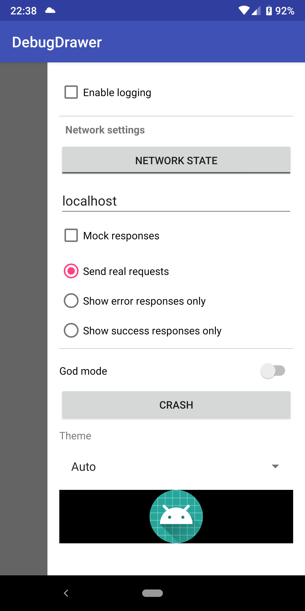
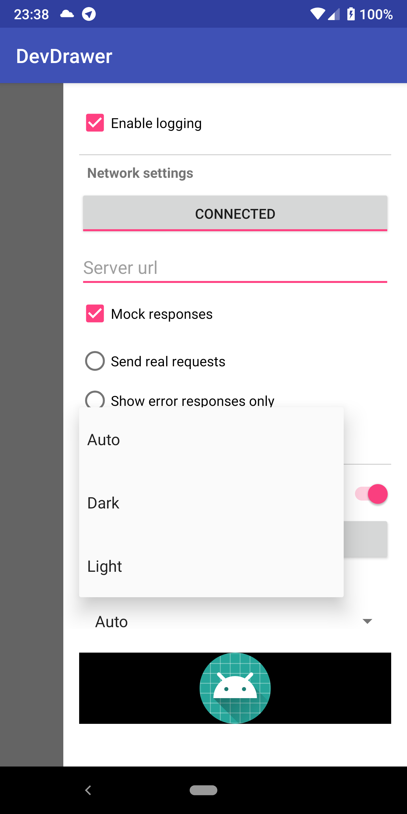

# DebugDrawer

Drawer that allows you to easily put options you may need to change while developing your app (e.g. 
switch between production and dev urls) into a side drawer.

It actually just wraps your activity's root layout into a `android.support.v4.widget.DrawerLayout`.

 

### How to use

In your activity or fragment call:

```kotlin
val settingsView: View = // inflate your view 
DevDrawer.attachTo(this, gravity = Gravity.END, contentView = settingsView)
```

## Kotlin DSL builder

If you're using Kotlin, you can create debug layout with nice DSL.

```kotlin
// Create options
val devOptions = devOptions {

    checkbox {
        text = "Enable logging"

        onCheckedChange { isChecked -> showToast("Logging enabled: $isChecked") }
    }
    
    switch {
        text = "God mode"
        onCheckedChange { isChecked -> showToast("God mode switched: $isChecked") }
    }
    
    button {
        text = "Crash"
        onClick { throw Exception("Intended crash") }
    }
    
    spinner {
        item { "Auto" }
        addItem("Dark") // another way to add item to a spinner
        item { "Light" }
        
        onItemSelected { item, position -> showToast("$item at $position") }
    }
}

// And then pass options to the `attachView` function
DevDrawer.attachTo(this, gravity = Gravity.END, contentView = devOptions.view)
```

Or you can combine that steps into one

```kotlin
DevDrawer.attachTo(this, gravity = Gravity.END) {

    checkbox {
            text = "Enable logging"
            onCheckedChange { isChecked -> showToast("Logging enabled: $isChecked") }
        }
        
        switch {
            text = "God mode"
            onCheckedChange { isChecked -> showToast("God mode switched: $isChecked") }
        }
        
        button {
            text = "Crash"
            onClick { throw Exception("Intended crash") }
        }
        
        spinner {
            item { "Auto" }
            addItem("Dark")
            item { "Light" }
            
            onItemSelected { item, position -> showToast("$item at $position") }
        }
}
```
### Available DevOptions

`DevOption` is basically a wrapper around a view. It allows you to  

 - [ButtonOption](#buttonoption)
 - [CheckBoxOption](#checkboxoption)
 - [EditTextOption](#edittextoption)
 - [RadioOption and RadioGroupOption](#radiooption-and-radiogroupoption)
 - [SpinnerOption](#spinneroption)
 - [SwitchOption](#switchoption)
 - [TextOption](#textoption)
 - [ToggleOption](#toggleoption)
 - [ViewOption](#viewoption)
 - [Section](#section)
 - [Divider](#divider)
 
#### ButtonOption
 
 ```kotlin
button(title = "Dangerous button") {
    text = "Dangerous button" // Title can also be set like this
    onClick { showToast("$title clicked") }
}
```
 
#### CheckBoxOption

```kotlin
checkbox {
    text = "Enable logging"
    onCheckedChange { isChecked -> showToast("Logging enabled: $isChecked") }
}
```

#### EditTextOption

```kotlin
editText {
     text = "localhost"
     hint = "Server url"
     onTextChanged { newText -> showToast(newText.toString()) }
}
```

#### RadioOption and RadioGroupOption

```kotlin
radioGroup {
    radioButton(isChecked = true) {
        text = "Send real requests"
    }
    radioButton {
        text = "Show error responses only"
    }
    radioButton(title = "Show success responses only")
    
    onCheckedChange { option ->
        showToast("${option.text} selected")
    }
}
```

#### SpinnerOption

```kotlin
spinner(mode = Spinner.MODE_DROPDOWN) {
    item { "Auto" }
    addItem("Dark") // another way to add item to a spinner
    item { "Light" }
    
    onItemSelected { item, position -> showToast("$item at $position") }
}
```

#### SwitchOption

```kotlin
switch {
    text = "God mode"
    isChecked = true
    
    onCheckedChange { checked -> showToast("God mode switched: $checked") }
}
```

#### TextOption

```kotlin
text { text = "Theme" }
```

#### ToggleOption

```kotlin
toggle {
    text = "Network state"
    textOn = "Connected"
    textOff = "Disconnected"
    onCheckedChange { isChecked -> showToast("Network: $isChecked") }
}
```

#### ViewOption

Allows you to put any view in `DevDrawer`

```kotlin
view {
    val image = ImageView(this@DslDrawerActivity)
    image.setImageResource(R.mipmap.ic_launcher)
    image.setBackgroundColor(Color.BLACK)
    image
}
```

#### Section

Section allows you to group options related to some category.
It actually just adds divider, text under divider (title) 
then views you specified in clojure and closing divider (optionally).

```kotlin
section(addClosingDivider = false) {
    title = "Network settings"

    toggle {
        text = "Network state"
        textOn = "Connected"
        textOff = "Disconnected"
        onCheckedChange { isChecked -> showToast("Network: $isChecked") }
    }

    editText {
        text = "localhost"
        hint = "Server url"
        onTextChanged { text -> showToast(text.toString()) }
    }

    checkbox {
        text = "Mock responses"
        onCheckedChange { isChecked -> showToast("Mock responses enabled: $isChecked") }
    }

    radioGroup {
        radioButton(isChecked = true) {
            text = "Send real requests"
        }
        radioButton {
            text = "Show error responses only"
        }
        radioButton(title = "Show success responses only")

        onCheckedChange { option ->
            showToast("${option.text} selected")
        }
    }
}
```

#### Divider
Basically it's just a view with specified height (default is `1dp`),
color (default is `Color.LTGRAY`) and width equal to parent's width.

```kotlin
divider {
    thickness = 1
    color = Color.LTGRAY
}
```

### Creating custom option
// TODO add tutorial

### License
// TODO
